# News Flash - Project Documentation

## 📋 Project Overview

News Flash är en tre-lagersarkitektur Flask-applikation som är containeriserad och deployed till Azure med en fullständig CI/CD-pipeline. Projektet demonstrerar moderna DevOps-praktiker.

---

## 🏗️ Architecture Overview

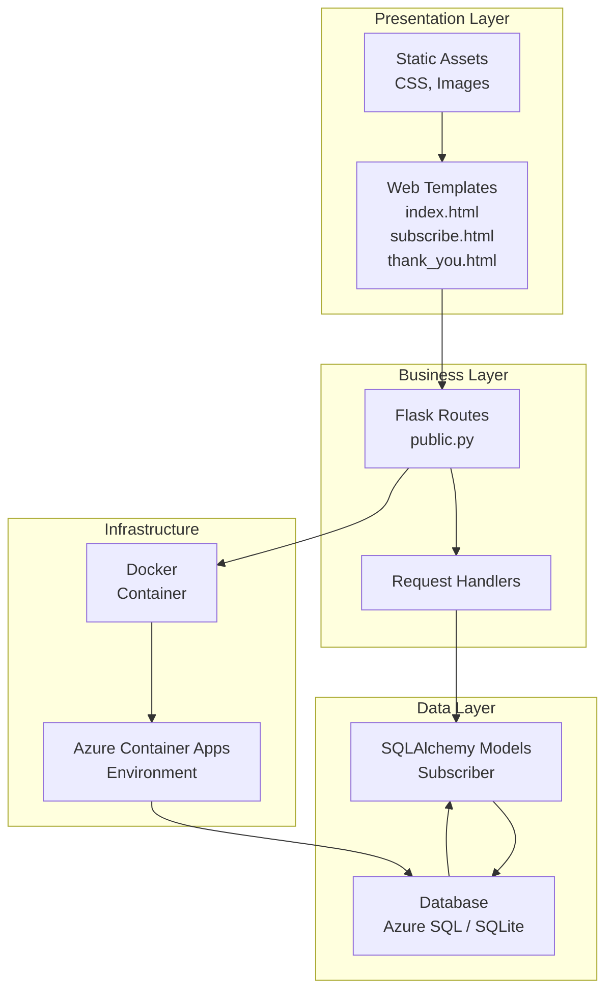

---

## 📁 Project Structure

```
Test.3tier/
├── application/
│   ├── app/
│   │   ├── __init__.py (Factory Pattern)
│   │   ├── config.py (12-Factor Config)
│   │   ├── database.py (SQLAlchemy)
│   │   ├── data/
│   │   │   └── models/
│   │   │       └── subscriber.py
│   │   ├── business/
│   │   │   └── services/
│   │   └── presentation/
│   │       ├── routes/
│   │       │   └── public.py
│   │       ├── templates/
│   │       │   ├── base.html
│   │       │   ├── index.html
│   │       │   ├── subscribe.html
│   │       │   └── thank_you.html
│   │       └── static/
│   ├── migrations/
│   │   ├── env.py
│   │   ├── alembic.ini
│   │   └── versions/
│   │       └── 001_create_subscribers_table.py
│   ├── requirements.txt
│   ├── wsgi.py (Gunicorn Entry Point)
│   └── entrypoint.sh (Startup Script)
├── Dockerfile
├── .dockerignore
├── .github/
│   └── workflows/
│       └── deploy.yml (GitHub Actions)
├── .azure-config (Secrets - .gitignore)
└── .gitignore
```

---

## 🔄 Deployment Flow

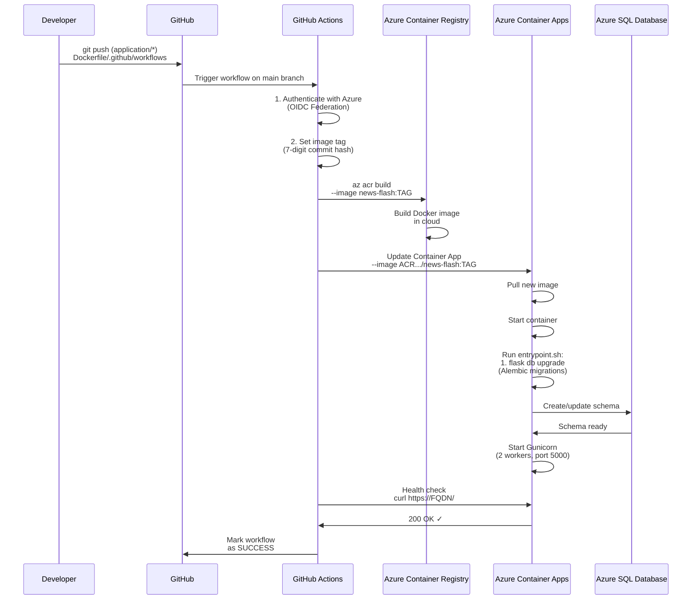

---

## 🚀 CI/CD Pipeline Details

### GitHub Actions Workflow Steps

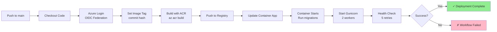

---

## 🔐 Security: OIDC Federation

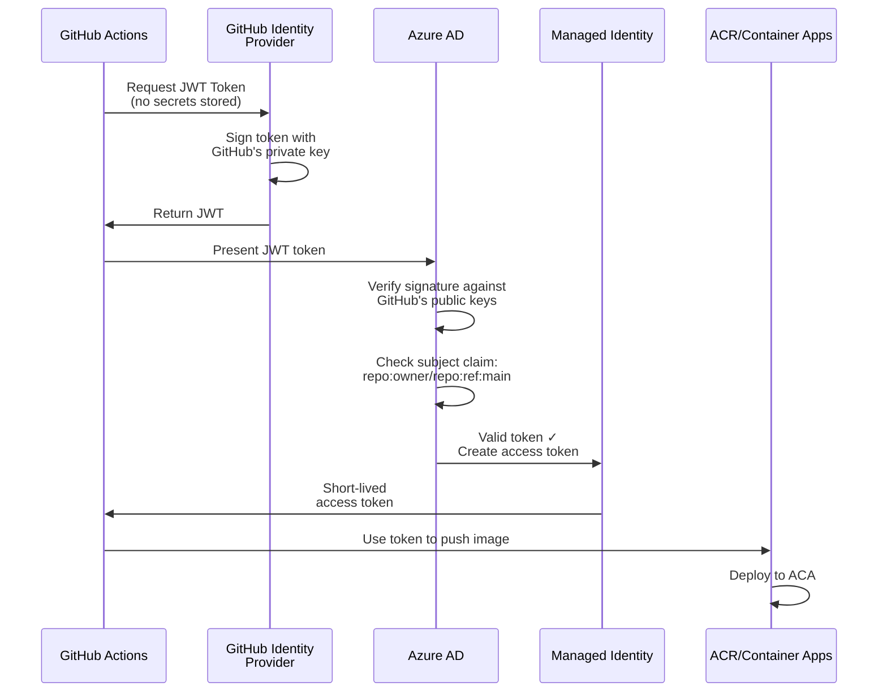

---

## 🔄 Application Request Flow

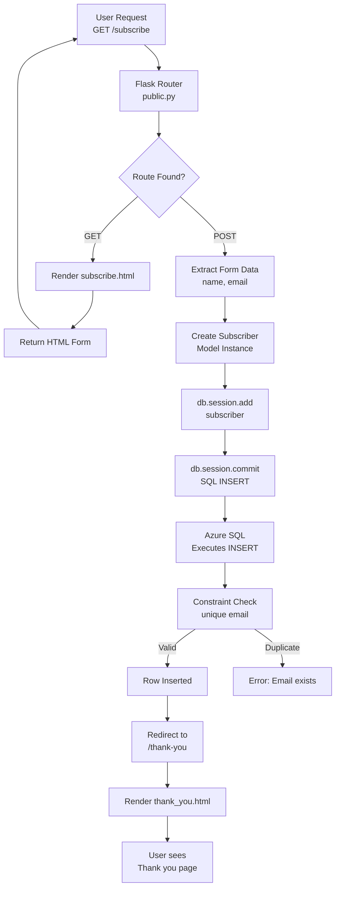

---

## 📊 Database Schema

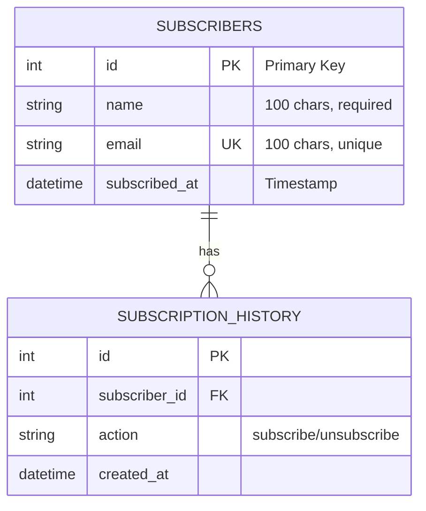

---

## 🔄 Configuration Management (12-Factor App)

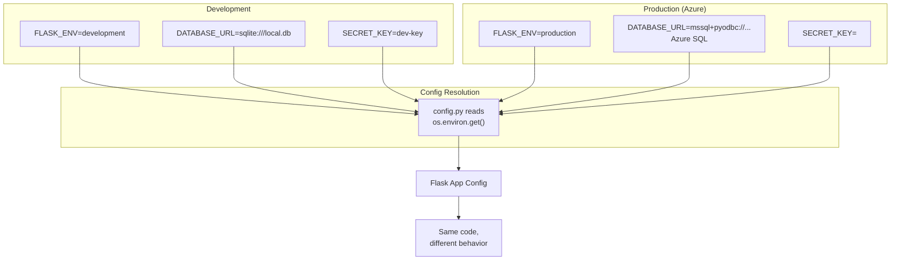

---

## 🐳 Docker Build Process

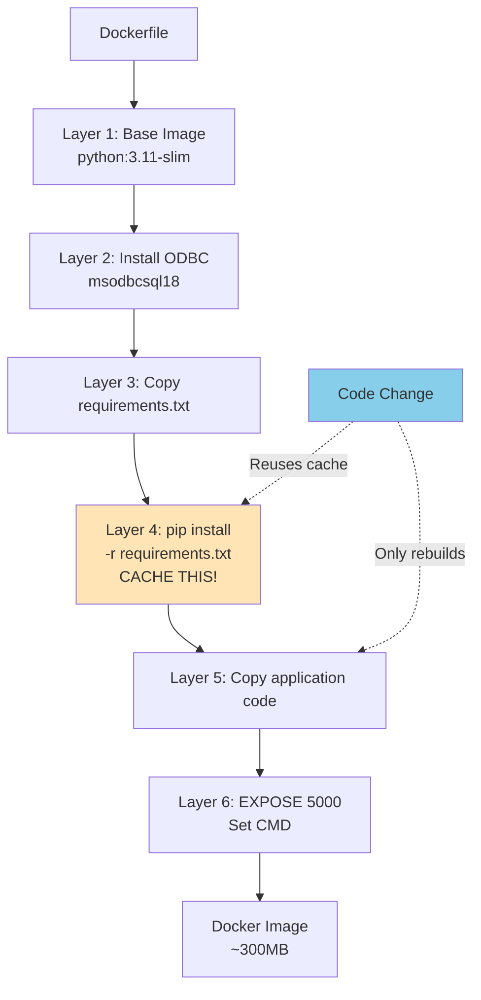

---

## 🔗 Migration Flow (Alembic)

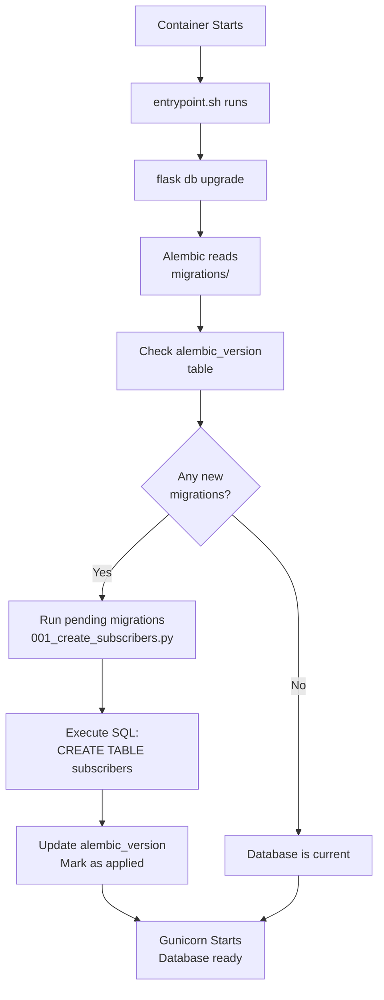

---

## 📈 Scaling & Performance

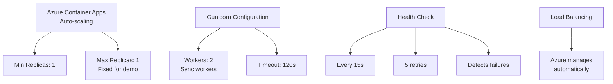

---

## 🔍 Monitoring & Logging

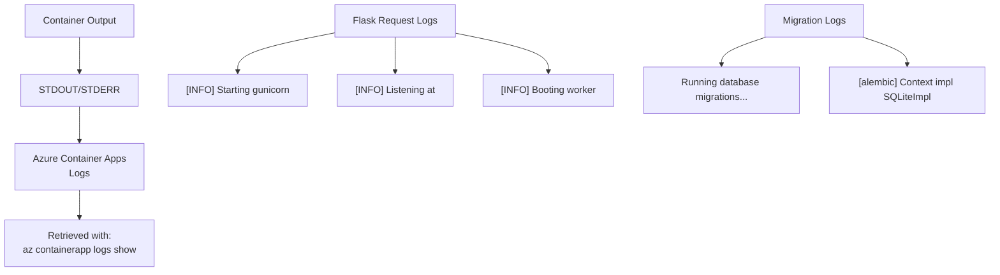

---

## 📝 Completed Exercises

### ✅ Exercise 1: Container-Ready Configuration
- **Goal**: Prepare app for containerization
- **What was done**:
  - Created `wsgi.py` - Gunicorn entry point
  - Updated `requirements.txt` - Added production dependencies (gunicorn, pyodbc, flask-migrate, flask-sqlalchemy)
  - Created `Dockerfile` - Multi-stage Docker image with ODBC driver
  - Created `entrypoint.sh` - Database migrations + Gunicorn startup
  - Created `.dockerignore` - Exclude unnecessary files
  - Verified `config.py` - Uses environment variables (12-Factor App)

**Result**: App is ready to run in containers

---

### ✅ Exercise 2: Provision Azure Infrastructure
- **Goal**: Set up Azure resources for deployment
- **What was done**:
  - Created Resource Group (`rg-news-flash`)
  - Created Container Registry (`acrnewsflashb488f5b7`)
  - Created Container Apps Environment (`cae-news-flash`)
  - Created Container App (`ca-news-flash`) with nginx placeholder
  - Registered ACR credentials on Container App
  - Provisioned Azure SQL Database (`sql-news-flash-7508d847`)
  - Configured firewall rules (AllowAzureServices, AllowAll for dev)
  - Set environment variables (FLASK_ENV, SECRET_KEY, DATABASE_URL)
  - Created `.azure-config` file

**Result**: Azure infrastructure ready for deployments

---

### ✅ Exercise 3: Deploy with GitHub Actions
- **Goal**: Automate build, deploy, and test pipeline
- **What was done**:
  - Created GitHub repository (`ludwigsevenheim-alt/news-flash`)
  - Pushed all code to GitHub
  - Created Managed Identity (`id-news-flash-deploy`)
  - Configured OIDC Federation (passwordless auth)
  - Created GitHub Actions workflow (`.github/workflows/deploy.yml`)
  - Set GitHub repository variables (CLIENT_ID, TENANT_ID, SUBSCRIPTION_ID, ACR_NAME)
  - Tested full pipeline: push → build → deploy → health check
  - Created Flask routes for subscribe functionality
  - Created Alembic migration to create `subscribers` table
  - Verified end-to-end: form submission → database persistence

**Result**: Fully automated CI/CD pipeline working

---

## 🎯 Key Technologies Used

| Component | Technology | Purpose |
|-----------|-----------|---------|
| **Language** | Python 3.11 | Application development |
| **Framework** | Flask 3.0+ | Web framework |
| **Database ORM** | SQLAlchemy | Data persistence |
| **Migrations** | Alembic/Flask-Migrate | Schema management |
| **WSGI Server** | Gunicorn 22.0.0 | Production web server |
| **Containerization** | Docker | Packaging |
| **Container Host** | Azure Container Apps | Managed container platform |
| **Database** | Azure SQL | Relational database |
| **Registry** | Azure Container Registry | Private Docker registry |
| **CI/CD** | GitHub Actions | Automation |
| **Authentication** | OIDC Federation | Passwordless auth |
| **Config** | Environment Variables | 12-Factor App |

---

## 🔐 Security Features

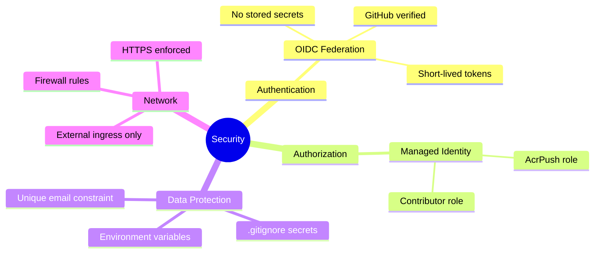

---

## 📊 Performance Characteristics

- **Container Image Size**: ~300MB (python:3.11-slim + ODBC driver)
- **Startup Time**: ~10-15 seconds (including migrations)
- **Gunicorn Workers**: 2 (sync workers)
- **Request Timeout**: 120 seconds
- **Database Connections**: Via pyodbc → ODBC Driver 18
- **Health Check**: Every 15 seconds, 5 retries

---

## 🚦 State Transitions

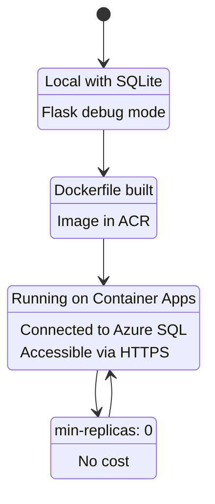

---

## 📚 Learning Outcomes

Through this project, the following concepts were mastered:

1. ✅ **Three-Tier Architecture**: Separation of presentation, business, and data layers
2. ✅ **Flask Application Factory Pattern**: Flexible app initialization
3. ✅ **12-Factor App Methodology**: Configuration via environment variables
4. ✅ **SQLAlchemy ORM**: Database models and migrations
5. ✅ **Alembic Migrations**: Version control for database schemas
6. ✅ **Docker**: Container packaging with layer caching optimization
7. ✅ **Azure Services**: Container Apps, SQL Database, Container Registry
8. ✅ **GitHub Actions**: CI/CD pipeline automation
9. ✅ **OIDC Federation**: Passwordless authentication
10. ✅ **Cloud Deployment**: End-to-end production deployment

---

## 🔄 Next Steps (Future Enhancements)

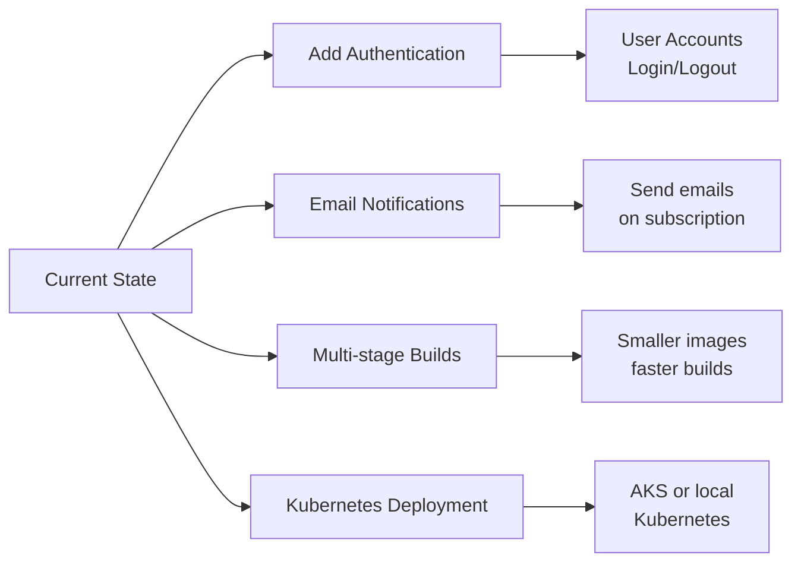

---

## 📋 Conclusion

News Flash är ett complete DevOps-projekt som demonstrerar:
- Modern application architecture
- Infrastructure as Code
- Automated deployments
- Cloud-native best practices
- Security through OIDC federation

**Total time invested**: ~6 hours across 3 exercises
**Lines of code written**: ~2000+ (app code + config)
**Commits made**: 7+ to GitHub
**Successful deployments**: 5+

---

**Project Status**: ✅ COMPLETE AND WORKING

All exercises passed with full end-to-end functionality verified.
